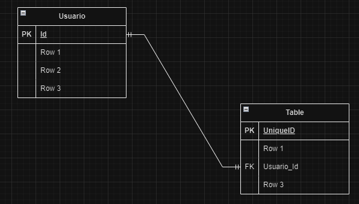
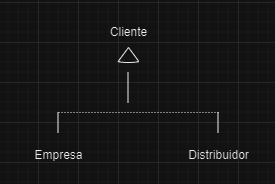
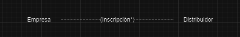
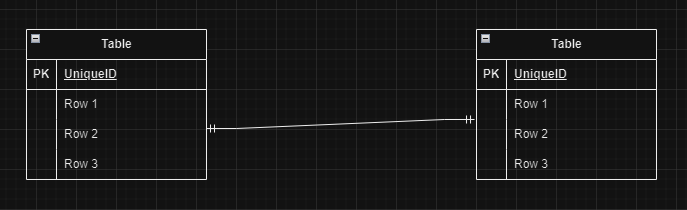
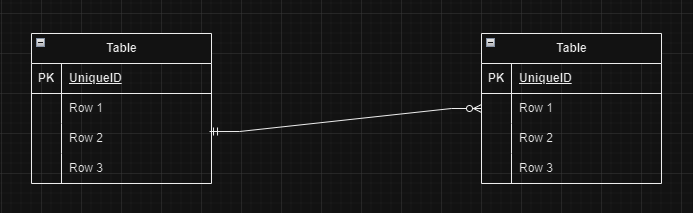
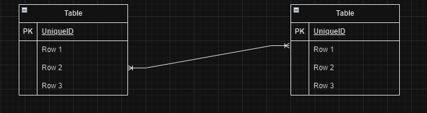
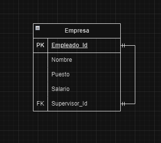

1. B, C, D

2. C

3. C

4. A, C, D

5. La clave primaria tiene la diferencia de que el id se encuentra en esa misma tabla, la clave foranea es cuando llamas una id de otra tabla distinta y la contienes en esa tabla nueva.

    

6. B

7. La herencia de datos en el modelo Entidad-Relacion Extendido (EER), facilita y representa de la manera mas fiel en el diseño de la base de datos, ademas de permitir relaciones jerarquicas entre las entidades de la base de datos.

Se representa con lineas que conectad las partes superiores que mandan la informacion a las otras entidades, asi:

8. C

9. A, B, C

10. Incluir restricciones de usuario en un diagrama ER es fundamental para garantizar que la base de datos cumpla con las reglas y políticas de la organización. Esto influye en el diseño del diagrama, ya que se deben agregar notas o anotaciones que especifiquen estas restricciones. Además, es necesario implementar y mantener estas restricciones en la base de datos para asegurar la integridad y validez de los datos.

11. C

12. A, B, C

13. B

14. Un diagrama Entidad-Relación (ER) es una representación gráfica utilizada para modelar la estructura lógica de una base de datos. Describe las entidades relevantes, las relaciones entre estas entidades y los atributos que caracterizan a cada entidad.

Un diagrama ER es una herramienta esencial en el diseño de bases de datos que ayuda a visualizar y organizar los datos de manera estructurada, asegurando que el modelo de datos sea claro, preciso y eficiente.

15. D

16. A, C

17. C

18. B

19. Entidad identificativa: Una entidad identificativa es cuando una entidad pertenece o existe gracias a otra, en el caso de una empresa y un empleado, el empleado existe como ente gracias a la entidad empresa.

Entidad no identificativa: es cuando las entidades existen independientes, pero pueden llegar a tener relación que las una, en el caso de una empresa puede ser un empleados y proyectos, los cuales son entes separados, pero por las condiciones de las dos pueden unirse a algunos.

20. A, C, D, E

21. C

22. A, B, C, D, E

23. Las cardinalidades es la forma de saber como se relaciones las entidades en la base de datos, esto se hace para que se refleje con exactitud lo que pasa en la vida real, hay varios tipos de cardinalidades, las cuales son:

(1 a 1):
    Esta relacion es cuando solo se puede hacer 1 para cada lado, una persona solo puede tener un numero de idnetificaión y un numero de identificación solo puede ser asignado a una persona.

(1 a M):
    Es cuando una entidad puede pertenecer a muchas cosas, pero 1 cosa no puede pertenecer a muchas entidades, es como cuando una persona puede tener muchos audifono, pero 1 audifono no puede pertenecer a varias personas.

(M a M):
    Es cuando muchas entidades pertenecen a varias cosas y viceversa, muchas personas pueden hacer varias comidas y varias comidas pueden ser para varias persoans.

24. C

25. A, C, E

26. D

27. Una relación recursiva es cuando una misma entidad tiene que estar varias veces en su misma tabla, por ejemplo en una empresa cuando hay que dar los roles y de quien van a estar acargo.

Aqui se muestra que el supervisor de cada empleado es sacado de la misma tabla, pero en algun momento fue creada entonces se le llama foranea.

28. C

29. A, C

30. 